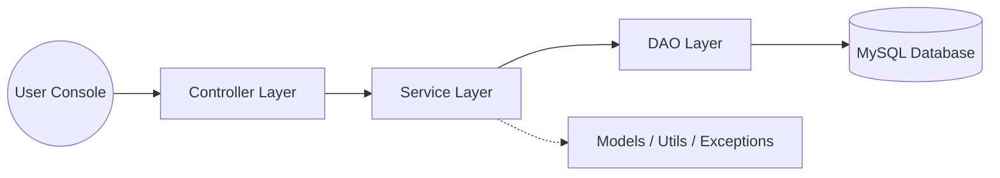

# 🏢 RevWorkForce – Console-Based HRM System

**RevWorkForce** is a sophisticated, backend-driven Human Resource Management (HRM) platform designed to simulate enterprise-grade organizational workflows within a console environment. Built with the **DAO–Service–Controller** pattern, it demonstrates robust architectural principles and database management mastery.

---

## 🛠 Tech Stack

   

   

---

## 🏗 Modular Architecture Design

The system is engineered for maximum maintainability and future scalability through a strict layered approach.



---

## 👥 Role-Based Capabilities

### 🧑‍💻 **Employee Module**
- 👤 **Profile Control**: View and update contact details and emergency info.
- 🗓 **Leave Lifecycle**: Apply for Sick, Casual, or Paid leaves with real-time status tracking.
- 💹 **Balance Overview**: Monitor remaining leave quotas dynamically.
- 🔐 **Security**: Self-service password updates for account safety.

### 👨‍💼 **Manager Module**
- 🦸 **Team Oversight**: Manage direct reports based on organizational hierarchy.
- ⚡ **Rapid Approvals**: Process leave requests with comments and mandatory justifications.
- 🔍 **Real-Time Visibility**: Filter and monitor team-wide leave calendars.

### 🛡️ **Admin Module**
- 🏗 **Enterprise Management**: Onboard new hires and update core employee records.
- 🖇 **Hierarchy Orchestration**: Define reporting managers and departmental structures.
- 💾 **Safe Deletion**: Implement **Soft Delete** logic via status-based filtering (Active/Inactive).

---

## 🔐 Core Business Intelligence
- 🛡 **Access Security**: Advanced Role-Based Access Control (RBAC) across all modules.
- 💎 **Data Integrity**: Foreign key constraints and self-referencing relationship management.
- 🚦 **Workflow Guardrails**: strict validation for leave applications and password changes.
- 🪵 **Strategic Logging**: Comprehensive **Log4j2** integration for audit trails and debugging.

---

## 📂 Project Anatomy
```text
com.revworkforce
├── 🎮 controller  # User interaction & console menus
├── 🧠 service     # Business logic & core validations
├── 💾 dao         # JDBC-driven database operations
├── 📦 model       # Entity representations (Employee, Leave)
├── 🛠 util        # Database connectivity & helpers
├── ⚠️ exception   # Custom error handling
└── 📊 validation  # Input integrity check layers
```

---

## 🎯 Development Roadmap
This foundational core is designed for seamless transition to modern web ecosystems:
- 🌐 **Web Integration**: Migration path to **Spring Boot** and RESTful APIs.
- 🔔 **In-App Messaging**: Real-time DB-driven alerts and announcements.
- 📈 **Talent Management**: Performance reviews, goal tracking, and OKRs.
- 🧩 **Scale-Out**: Future refactoring into a **Microservices** architecture.

---
